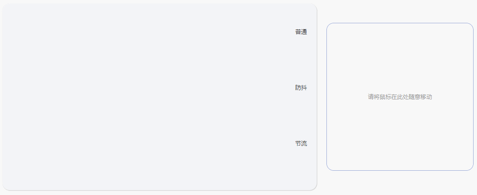

# frontends
> 前端技术、框架例程、实现与文档集合。记录了前端的学习历程，帮助构筑前端技术栈。

## 目录结构：
- `admins` 针对后台管理系统提出的一些解决方案
- `bom` 浏览器对象模型知识学习
- `bui` bui的学习经历，关于本人对bui的扩展UI可见仓库：[bui-ui](https://github.com/shoppingzh/ui/tree/master/bui-ui)
- `cors` 跨域学习与解决方案(jsonp/cors/反向代理等)
- `demos` 对于一些常用第三方库的使用例程(如图形库、手势库、媒体库等)
- `docs` 文档集合
- `dom` 浏览器对象模型学习集合
- `es` ECMAScript 2015以前的js学习
- `es6`ESMAScript 2015特性学习
- **`functions`** 个人函数集合
- `liveroom` 一个基于vue的直播间例程(UI类似腾讯直播)
- `pdfjs` pdf库学习集合
- `rich-editor` 富文本编辑器学习集合
- `server-template` 基于express的服务端模板工程，主要用于快速搭建服务端(如mock服务器)
- `tech` 前端技术集合
- **`vue`** vue学习集合
- `vue-router` vue router学习集合
- `webpack` webpack学习集合

## 文档集合
- [变量提升](docs/es/变量提升.md)
- [es6基础](docs/es/es6基础.md)
- [模块化](docs/es/模块化.md)
- [箭头函数](docs/es/箭头函数.md)

## 好玩的东西

#### 1. 防抖、节流可视化

#### 2. 像素提取

#### 3. 洗牌效果

