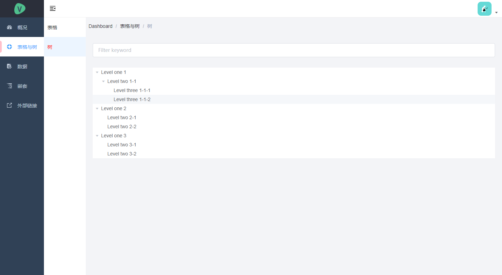
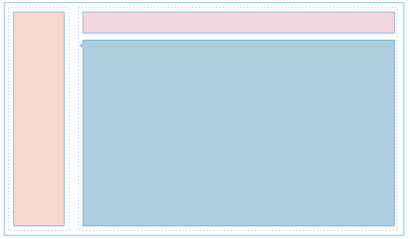
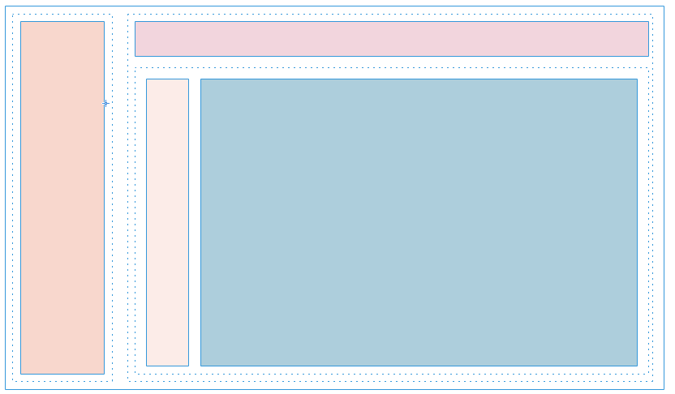

## 一、简述：双栏式菜单的优缺点
对于传统的后台布局方案，双栏式菜单布局有着鲜明的优缺点。其优点有：

- **直观的展示。**在预览菜单时，双栏式的布局几乎可以将一级菜单与二级菜单尽收眼底。
- **更易操作。**不管是切换一级菜单，还是切换二级菜单，双栏式的布局都更易操作。单栏式的布局必须将菜单进行折叠展示，对于菜单项较多的情况，用户需要花费很多的时间将菜单不断地展开、收起；并且在有三级菜单的情况下，单栏式很难给予用户良好的使用体验。而在双栏式的布局中，二级菜单可以设计为可折叠的，这样真实可用的菜单级数就变为了三级：左侧一级，右侧二至三级。

其缺点也很明显：

- **更占用空间。**双栏式不管怎么压缩空间都比单栏式更加占用空间，因此在选择布局方案时，要综合多方面进行考虑，如果需要兼容到移动屏幕，则需要考虑一二级菜单在小屏幕上的折叠问题。


## 二、对vue-element-admin进行改造，实现双栏式菜单布局


上图是vue-element-admin的布局方案，左侧为菜单栏，右侧为主体区域，其中主体区域又包括了顶部的导航栏与下方的内容区。


为了实现上述的双栏式菜单布局，我们需要在主体区域增加一个二级菜单区，并且让主体部分的内容区为二级菜单区域让路。更加后的布局方案如下图所示：



## 三、实现思路
对框架布局的修改，我们尽可能少地改动了原来的代码，并且实现目前来看，还算优雅。具体的实现步骤如下：
1. 将框架原有的一级菜单进行改造，去除子级菜单的折叠/展开，只展示顶层菜单；
2. 在主体区域开辟一个新的侧边栏，宽度约为120px，内容区域让出120px的左侧区域；
3. 只有在顶级菜单有两个以上可展示的子级菜单时才展示二级菜单侧边栏，如果没有菜单，内容区占据主体区域的全部宽度；
4. 一级、二级菜单栏在纵向须是可滚动的，这里的滚动需使用模拟滚动而不是浏览器滚动，参考`<el-scrollerbar>`组件；
5. 二级菜单栏展示二级和三级菜单，默认是全部展开的，以免用户频繁折叠、展开；
6. 需要注意浏览器直接刷新的情况下，一级、二级菜单的选中效果是否保留，这里不能仅仅依赖与用户交互（用户点击某个菜单，菜单变色），而要基于当前路由


## 四、具体实现
具体实现请参见[vue-element-admin-double-column](vue-element-admin-double-column)项目中的源码。以下仅贴出抽象后的菜单项组件的源码：

```vue
<template>
  <div v-if="show">
    <template v-if="children && children.length">
      <el-submenu :index="resolvePath(item.path)">
        <item :icon="item.meta ? item.meta.icon : ''" :title="item.meta ? item.meta.title : ''" />
        <route-menu
          v-for="child in children"
          :key="child.path"
          :item="child"
          :base-path="resolvePath(item.path)"
          :multilevel="false"
        />
      </el-submenu>
    </template>
    <app-link v-else :to="resolvePath(item.path)">
      <el-menu-item :index="resolvePath(item.path)">
        <item :icon="item.meta ? item.meta.icon : ''" :title="item.meta ? item.meta.title : ''" />
      </el-menu-item>
    </app-link>
  </div>
</template>

<script>
import AppLink from './Link'
import Item from './Item'
import path from 'path'
import { isExternal } from '@/utils/validate'

export default {
  name: 'RouteMenu',
  components: {
    AppLink,
    Item
  },
  props: {
    item: {
      type: Object,
      required: true
    },
    basePath: {
      type: String,
      default: ''
    },
    multilevel: {
      type: Boolean,
      default: false
    }
  },
  data() {
    return {
    }
  },
  computed: {
    children() {
      if (!this.multilevel) {
        return []
      }
      const children = this.item.children || []
      return children.filter((o) => {
        return !o.hidden
      })
    },
    show() {
      return !this.item.hidden
    }
  },
  mounted() {
  },
  methods: {
    resolvePath(routePath) {
      if (isExternal(routePath)) {
        return routePath
      }
      if (isExternal(this.basePath)) {
        return this.basePath
      }
      return path.resolve(this.basePath, routePath)
    }
  }
}
</script>

<style>
</style>
```