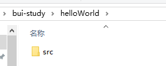
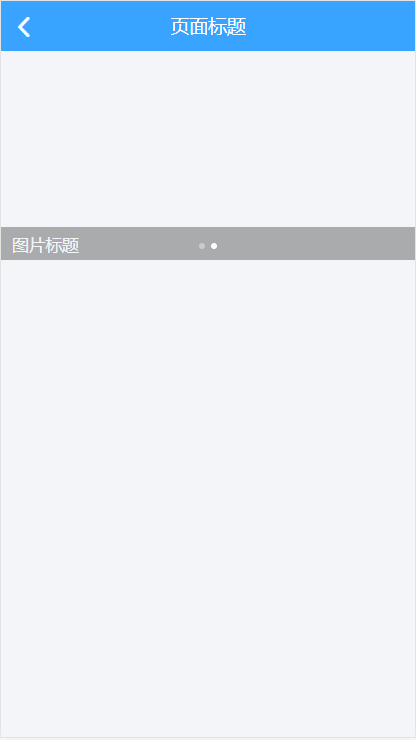

1. 下载BUI开发包（一般下载单页开发包）
    [下载地址][https://imouou.github.io/BUI-Guide/#/chapter1/installation]


2. 下载VSCode（世界上最强大的IDE），安装bui-fast与Live Server(本地服务器)插件
    


3. 新建一个项目，将下载的BUI开发包解压，将解压目录下的src目录复制到项目目录下：



4. 在项目根目录下新建index.html（下载的包中已有，删除，自己重新创建），在index.html中输入"ui-html"，利用bui-fast插件的功能自动生成一个bui的html结构，如下：
```html
<!DOCTYPE HTML>
<html>
<head>
    <meta http-equiv="Content-Type" content="text/html;charset=UTF-8" />
    <title>BUI</title>
    <meta name="format-detection" content="telephone=no" />
    <meta name="viewport" content="width=device-width, initial-scale=1, maximum-scale=1, minimum-scale=1, user-scalable=no">
    <link rel="stylesheet" href="css/bui.css" />
    <link rel="stylesheet" href="css/style.css" />
</head>
<body>

    <!-- 依赖库 手机调试的js引用顺序如下 -->
    <script src="js/zepto.js"></script>
    <script src="js/bui.js"></script>
    <script>
        bui.ready(function () {
            // 这里写业务及控件初始化
            
        })
    </script>
</body>
</html>
```


5. 在生成的html中输入“ui-page”生成bui的page结构：
```html
<div class="bui-page">
    <header class="bui-bar">
        <div class="bui-bar-left">
            <a class="bui-btn" onclick="bui.back();"><i class="icon-back"></i></a>
        </div>
        <div class="bui-bar-main">页面标题</div>
        <div class="bui-bar-right">
            <!-- 右边按钮 -->
        </div>
    </header>
    <main>
        <!-- 正文内容 -->
    </main>
    <footer>
        <!-- 底部内容 -->
    </footer>
</div>
```


6. 在main标签下输入“ui-slide”生成一个slide组件结构：
```html
<div id="uiSlide" class="bui-slide">
    <div class="bui-slide-main">
        <ul>
            <li>
                <!--第1屏-->
                
                <div class="bui-slide-title">图片标题</div>
            </li>
            <li style="display:none;">
                <!--第2屏-->
                
                <div class="bui-slide-title">图片标题</div>
            </li>
        </ul>
    </div>
</div>
```


7. 在js中的bui.ready事件中，初始化slide组件（输入"bui-slide"自动生成初始化代码）：
```javascript
var uiSlide = bui.slide({
    id:"#uiSlide",
    height:380,
    autopage: true,
    loop: true
});

uiSlide.to(1); // 让slide滚动到第二页
```


8. 启动服务器，查看效果（因为图片没有设置，所以显示的是空白内容）：



9. 最后，附上index.html源码：
```html
<!DOCTYPE HTML>
<html>
<head>
    <meta http-equiv="Content-Type" content="text/html;charset=UTF-8" />
    <title>BUI</title>
    <meta name="format-detection" content="telephone=no" />
    <meta name="viewport" content="width=device-width, initial-scale=1, maximum-scale=1, minimum-scale=1, user-scalable=no">
    <link rel="stylesheet" href="css/bui.css" />
    <link rel="stylesheet" href="css/style.css" />
</head>
<body>

    <div class="bui-page">
        <header class="bui-bar">
            <div class="bui-bar-left">
                <a class="bui-btn" onclick="bui.back();"><i class="icon-back"></i></a>
            </div>
            <div class="bui-bar-main">页面标题</div>
            <div class="bui-bar-right">
                <!-- 右边按钮 -->
            </div>
        </header>
        <main>
            <!-- 正文内容 -->
            <div id="uiSlide" class="bui-slide">
                <div class="bui-slide-main">
                    <ul>
                        <li>
                            <!--第1屏-->
                            
                            <div class="bui-slide-title">图片标题</div>
                        </li>
                        <li style="display:none;">
                            <!--第2屏-->
                            
                            <div class="bui-slide-title">图片标题</div>
                        </li>
                    </ul>
                </div>
            </div>
        </main>
        <footer>
            <!-- 底部内容 -->
        </footer>
    </div>

    <!-- 依赖库 手机调试的js引用顺序如下 -->
    <script src="js/zepto.js"></script>
    <script src="js/bui.js"></script>
    <script>
        bui.ready(function () {
            // 这里写业务及控件初始化
            
        })

        // 焦点图 js 初始化:
        var uiSlide = bui.slide({
            id:"#uiSlide",
            height:380,
            autopage: true,
            loop: true
        });
        uiSlide.to(2);
    </script>
</body>
</html>
```


**如果你已经安装了VSCode，那么整个过程应当在3分钟之内可以完成。**