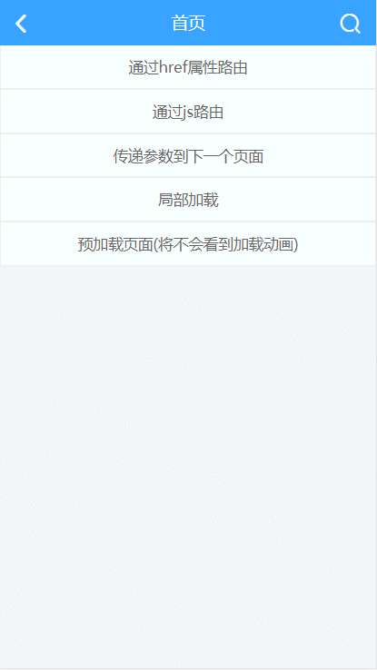

##  单页路由的初始化


1. 在index.html的body标签添加router组件，如下所示：
```html
<body>
    <!-- 第1步: 开启单页路由 -->
    <div id="bui-router"></div>

    <div class="bui-page">
        <header class="bui-bar">
            <div class="bui-bar-left">
                <a class="bui-btn" onclick="bui.back();"><i class="icon-back"></i></a>
            </div>
            <div class="bui-bar-main">路由</div>
            <div class="bui-bar-right">
                <!-- 右边按钮 -->
            </div>
        </header>
        <main>
            <!-- 正文内容 -->
           
        </main>
        <footer>
            <!-- 底部内容 -->
        </footer>
    </div>

    <script src="js/zepto.js"></script>
    <script src="js/bui.js"></script>
    <!-- 初始化单页 -->
    <script src="index.js"></script>
    <script>
        var uiReady = bui.ready(function(){
            // 原生事件初始化
        });
    </script>
</body>
```


2. 在index.js中开启路由功能：
```javascript
// 将router组件交给window对象，这样在任何js中都可以使用了
window.router = bui.router();

bui.ready(function() {
    // 初始化路由
    router.init({
        id: "#bui-router",
        progress: true,
        hash: true,
    })
})
```

**注：开启了路由功能后，index.js会自动查找main模块下的main.html与main.js，这就是主模块的入口了，你也可以理解为这就是app的首页了。**


3. 接下来，我们在main.html中放置一些内容用于区分，main.html内容如下：
```html
<!-- 这里还是一个标准的BUI页面 -->
<div class="bui-page">
  <header class="bui-bar">
    <div class="bui-bar-left">
      <!-- 左边有图标示例 -->
      <div class="bui-btn btn-back"><i class="icon-back"></i></div>
    </div>
    <div class="bui-bar-main">首页</div>
    <div class="bui-bar-right">
      <!-- 右边有图标示例 -->
      <div class="bui-btn"><i class="icon-search"></i></div>
    </div>
  </header>
  <main>
    <!-- 中间内容 -->
    app首页
  </main>
  <footer>
    <!-- 底部内容 -->
  </footer>
</div>
```


**为什么main.html不需要html结构？**
这是一个很经典的问题，很多ui框架都是基于此模式设计的。对于单页应用，你可以这么理解，整个页面中就一个同步加载的页面（在这里就是你在浏览器中键入“index.html”后按下回车时同步加载的页面），之后所有的页面都是通过ajax加载然后渲染到当前页面上的，因为页面没有发生同步操作，当前页面的dom结构就不可能丢失，又因为在index.html中已经将应该引入的css、js都引入了，所以不需要再引入这些静态文件。并且，由于index.html中已经有html的结构了，所以main.html中也可以没有html结构，index.html页面通过ajax将main.html加载过来后填充到了body内（更准确的说应该是路由组件#ui-router内）。


## 路由API
#### 页面跳转
```javascript
router.load({
    url: 'pages/user/add.html', // 跳转的url
    param: { // 传递参数[object]
        name: 'zxp',
        age: 22
    },
    replace: false, // 是否替换当前界面（不会增加历史记录）
    reload: false, // 是否重新加载，适用于单页应用跳转到单页应用
});
```
#### 接收参数
```javascript
var param = router.getPageParams();
```
#### 页面后退
```javascript
router.back({
    index: -1, // 后退层数
    name: 'main', //模块名称
    callback: function(){ // 后退后的回调
        router.refresh();
    }
});
```
#### 页面刷新
```javascript
router.refresh();
```
#### 页面替换
*页面替换是指将当前页面替换为其他内容，不会记录访问历史（注：设置load函数的replace属性为true可达到替换的效果）。*
```javascript
router.replace({
    url: 'pages/user/add.html', // 跳转的url
    param: { // 传递参数[object]
        name: 'zxp',
        age: 22
    },
});
```


## 通过路由跳转页面(页面表现与参数传递)
### 1. 通过bui-btn或a标签的href属性跳转
在main.html中定义一个按钮：
```html
<div class="bui-btn" href="pages/routers/page.html">通过href属性路由</div>
```


**注：这里要注意href属性的内容，该值并不是page.html相对main.html的路径，而是固定的以pages开头的路径，原因是BUI会自动查找pages下的模块下的html文件（因为pages是确定存在的目录，此目录代表app下的所有页面）**


### 2. 通过路由函数跳转
```html
<div class="bui-btn" id="route">通过js路由</div>
```

```javascript
$('#route').on('click', function(){
    router.load({
        url: 'pages/routers/page.html'
    });
});
```


### 3. 跳转并传参
```html
<div class="bui-btn" id="route-param">传递参数到下一个页面</div>
```
```javascript
$('#route-param').on('click', function(){
    router.load({
        url: 'pages/routers/page.html',
        param: {
            name: 'zxp',
            age: 22
        }
    });
});
```


### 4. 下一个页面接收参数
```javascript
var param = router.getPageParams();
$('#paramShow').text('我接收到参数：' + JSON.stringify(param));
```


### 5. 后退
```html
<div class="bui-btn" id="back">返回上一层</div>
<div class="bui-btn" id="back2">向上返回两层</div>
<div class="bui-btn" id="back-home">管它多少层，直接后退到首页</div>
```
```javascript
$('#back').on('click', function(){
    router.back();
});

$('#back2').on('click', function(){
    router.back({
        index: -2
    });
});

$('#back-home').on('click', function(){
    router.back({
        name: 'main'
    });
});
```


### 6. 局部加载 [重要]
#### 6.1 何时需要局部加载？
例如加载耗时内容，根据用户点击按需响应一个内容，这些都需要局部记载。

#### 6.2 如何使用局部加载？
##### 6.2.1 准备局部内容，此处定义了一个part.html文件，内容如下：
```html

```
这里注意两个问题，第一是局部内容不需要page结构，因为part.html是一个局部内容，而不是一个页面，第二是图片的src仍然跟加载页面一样，不需要使用相对路径，直接使用images下的路径即可。
##### 6.2.2 在父级页面中定义一个局部元素，将局部内容加载到该局部元素中
```html
<!-- 这里还是一个标准的BUI页面 -->
<div class="bui-page">
  <header class="bui-bar">
    <div class="bui-bar-left">
      <!-- 左边有图标示例 -->
      <div class="bui-btn btn-back"><i class="icon-back"></i></div>
    </div>
    <div class="bui-bar-main">首页</div>
    <div class="bui-bar-right">
    </div>
  </header>
  <main>
    <div id="part"></div>
  </main>
  <footer>
  </footer>
</div>

```
```javascript
$('#route-part').on('click', function(){
    // 将页面内容加载到#part元素中
	router.loadPart({id:"#part", url:"pages/routers/part.html"});
});
```


### 7. 预加载
#### 7.1 预加载的使用场景
预加载很适用于不需要根据用户操作而进行加载的页面，如预加载某个商品列表中所有列表的详情是不合理的做法，因为加载哪个商品详情取决于用户的选择；但是如果商品列表页面右上角有一个按钮“热门商品”，用户点击该按钮时将展示热门商品，该热门商品页面我们可以使用预加载，因为用户极有可能点击此按钮，并且要加载的内容是确定的，而预加载的好处就是让体验跟流畅，当用户点击热门商品按钮时页面会很快地展示出来。


#### 7.2 如何使用预加载？
```javascript
$('#route-pre').on('click', function(){
    router.load({
        url: 'pages/routers/pre.html'
    });
});
```


## 效果预览
